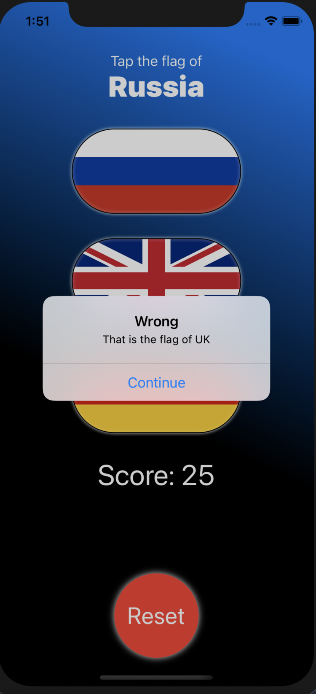

# FlagQuiz

> A SwiftUI App using custom views and adding a simple animation.

[![Swift Version][swift-image]][swift-url]
[![License][license-image]][license-url]

Exploring SwiftUI with a simple flag quiz game.



## Features
1. SwiftUI
2. Alerts
3. Custom Veiew
4. Gradients
5. Animation

## Requirements 
- iOS 14.0+
- Xcode 9.3+

## Installation
1. Download and drop ```FlagQuiz.swift``` in your project.  

[swift-image]:https://img.shields.io/badge/swift-5.0-orange.svg
[swift-url]: https://swift.org/
[license-image]: https://img.shields.io/badge/License-MIT-blue.svg
[license-url]: https://opensource.org/licenses/MIT
